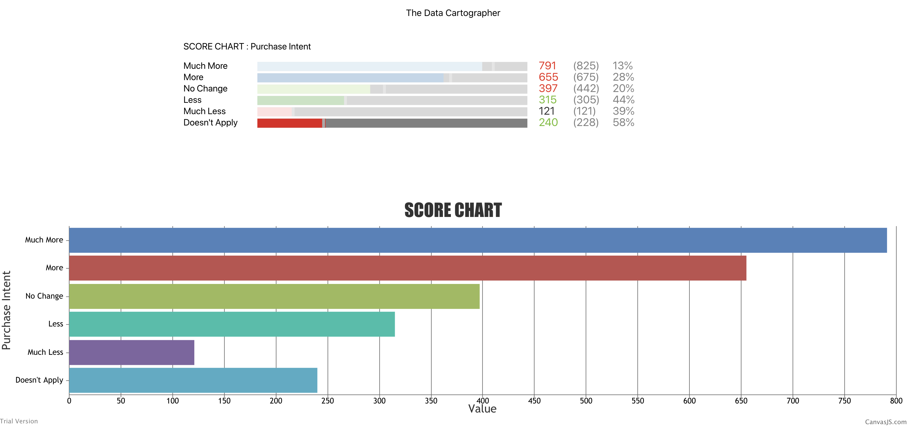

# BasicChart-Typescript-ContextAPI
A basic create-react-app template that I modeled a sample chart with dummy data to show how charting interacts with typescript and context API.

To run, just use npm install and npm run start

 